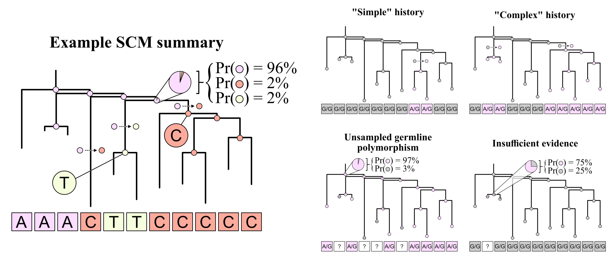
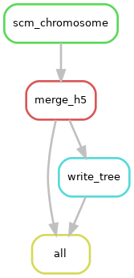

# Stochastic character mapping of somatic mutations

*Note: This repository is under active development.*

## Table of contents
- [Stochastic character mapping of somatic mutations](#stochastic-character-mapping-of-somatic-mutations)
  - [Table of contents](#table-of-contents)
  - [1. About](#1-about)
  - [2. Data prerequisites](#2-data-prerequisites)
  - [3. Repository organization](#3-repository-organization)
  - [4. Rulegraph](#4-rulegraph)
 
## 1. About


Github repository containing the code to apply [stochastic character mapping](https://pmc.ncbi.nlm.nih.gov/articles/PMC1403802/) (SCM) to somatic single-nucleotide variants (SNVs). The Snakemake workflow here is specifically designed to accommodate single-cell stratified data comparable to those generated for, e.g., [isogenic hematopoietic clones](https://www.nature.com/articles/s41586-022-04786-y) or [single-cell whole genome-sequencing data](https://www.biorxiv.org/content/10.1101/2025.10.11.681805v1). This approach is part of a larger study that aims to investigate the frequency, predictors, and consequences of somatic mutations that evolve in violation of the infinite sites model of evolution.

An early implementation of the SCM to model the evolutionary history of an arbitraty somatic variant is presented in the [`shortTL_hematopoiesis` github repository](https://github.com/mccoy-lab/shortTL_hematopoiesis), available [here](https://github.com/mccoy-lab/shortTL_hematopoiesis/blob/7a80540af4304d2ec6e2e0cae5bc4c360b12f6c3/analyses/3_stochastic_character_mapping/scm.pdf).

The implementation of SCM in this workflow leverages the [`phytools` comparative phylogenetics toolkit](https://doi.org/10.7717/peerj.16505), and SCM summaries are stored as [HDF5 files](https://support.hdfgroup.org/documentation/hdf5/latest/_intro_h_d_f5.html) which can accommodate the variation in data size and structure across SCM summary stats.

## 2. Data prerequisites
The data prequisites for the Snakemake workflow are organized via a `config.yaml` (a template can be found [here](`smk/config/config_template.yaml`)).  
In brief, the workflow requires the following data per donor:
1. **A multi-sample VCF** file containing biallelic somatic SNVs called across all samples (e.g., single-cells) per donor. A [Phred-scaled genotype likelihood](https://gatk.broadinstitute.org/hc/en-us/articles/360035890451-Calculation-of-PL-and-GQ-by-HaplotypeCaller-and-GenotypeGVCFs) (`PL`) element is required in the `FORMAT` field, as these values are used to compute scaled genotype probabilities for use as genotype-state priors in SCM. An example of a `FORMAT` field containin `PL` scores is shown below:
```
FORMAT                  clone1                          clone2                          ...
GT:AD:DP:GQ:PL:VAF      0/1:5,3:8:60:60,0,117:0.375     0/0:10,0:12:30:0,30,286:0       ...
GT:AD:DP:GQ:PL:VAF      0/1:4,4:8:50:50,0,100:0.5       0/1:6,6:12:60:60,0,120:0.5      ...
...                     ...                             ...                             ...
```

2. **A molecular phylogeny** (newick format) with branch lengths measured in genotype substitutions per site. At present, we recommend the use of [`CellPhy` for phylogenetic inference](https://github.com/amkozlov/cellphy), as it designed to reconstruct somatic phylogenies from somatic SNVs while accounting for technical artifacts (e.g., allelic dropout) that are common in single-cell data.
```
(clone2:0.020321,clone1:0.029519)100:0.019519,(((clone3:0.036173,...
```

3. **An unphased genotype substitution model** that captures both the relative rates and genotype state frequencies of the data. Using `CellPhy`, both the molecular phylogeny and genotype substitution model can be inferred simultaneously from the multi-sample VCF file.
```
GT10{0.001000/1.979766/2.598794/3.482508/1.000000/2.315514/1.900595}+FU{0.157963/0.287340/0.280840/0.158375/0.008751/0.037105/0.010944/0.010282/0.040406/0.007993}, noname = 1-10000 
```

## 3. Repository organization

The code in this repository is organized into the following directories:

```
somatic_mutation_scm/
├── LICENSE                        # License for the repository
├── README.md                      # This file
├── docs/                          # Documentation and notebooks related to code/theory development and testing
│   ├── figs/                      # Figures for the documentation
│   └── notebooks/                 # Jupyter notebooks for code/theory development and testing
└── smk/                           # Snakemake workflow for applying stochastic character mapping to somatic SNVs
    ├── config/                    # Configuration files for the Snakemake workflow
    ├── example_data/              # Example input files for testing purposes
    ├── workflow/                  # Snakemake rules, scripts, and environments for the workflow
    │   ├── bin/                   # Code for running Snakefile rules and applying stochastic character mapping to somatic SNVs
    │   ├── envs/                  # Conda environments for the Snakemake workflow
    │   └── Snakefile              # Snakemake workflow for applying stochastic character mapping to somatic SNVs
    └── smk7_scm.yaml              # Conda environment for running the Snakemake workflow
```

## 4. Rulegraph

